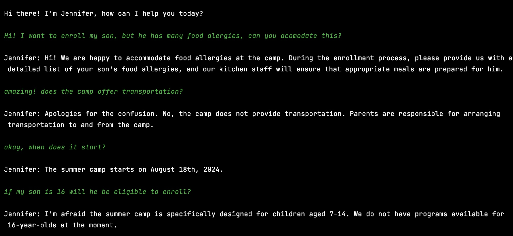

# GenAI Summer Camp Chatbot Project 🌐
## Paradox Home Assignment 👾

### Developer: Maya Halevy

## Overview
This project consists of a Python-based chatbot designed for the GenAI Summer Camp. The chatbot, named Jennifer, assists in handling inquiries about the camp and managing the registration process for campers parents. The project is structured into two main files: chatbot.py, which contains the main logic, and constants.py, which houses the necessary constants for initializing the chatbots.

## Installation
- Ensure Python is installed on your system.
- Install the openai Python package: `pip install openai`
- Set the `OPENAI_API_KEY` environment variable with your OpenAI API key.

## Running the Project
Execute chatbot.py to start the chatbot. Interact with the chatbot in the console to get information about the GenAI Summer Camp or to proceed with the registration.

## Open Questions

### How would you optimize the process if you had more time?

I would incorporate another chatbot to discuss registration details with the parent, and then send that conversation to a model in order to parse the registration info from the conversation.

### How would you test the prompts' performance?

I have tested the prompts performance over several possible conversations. The general inquiry chatbot was originally consistently telling parents that the camp provided transportation services, despite the training samples indicating otherwise. I decided to consult chatgpt on this, and foudn that the most likelyt reason is that gpt.3.5 training data contains far more situations of camps providing transportation than not. I wanted to stick with this policy as it would help demonstrate that the chatbot is able to be effectively trained even with few shot learning. Once I incorporated this element into the model's persona, instead of just leaving it as a training example, the model began responding correctly. 

As for the router model I tested it on many wordy examples, to make sure it performed beyond a hard-coded program that simply searches for the keywords 'enroll', 'register', 'apply', etc. This model is now able to understand nuance, and only deploys the registration form when the user is ready to fill it. 

Below I will include a brief snippet of a conversation with Jennifer:

### What edge cases do you think are not handled currently that you would add?

It would be useful to add user input validation, handling of irrelevant inputs, and adding other languages.

  ג
